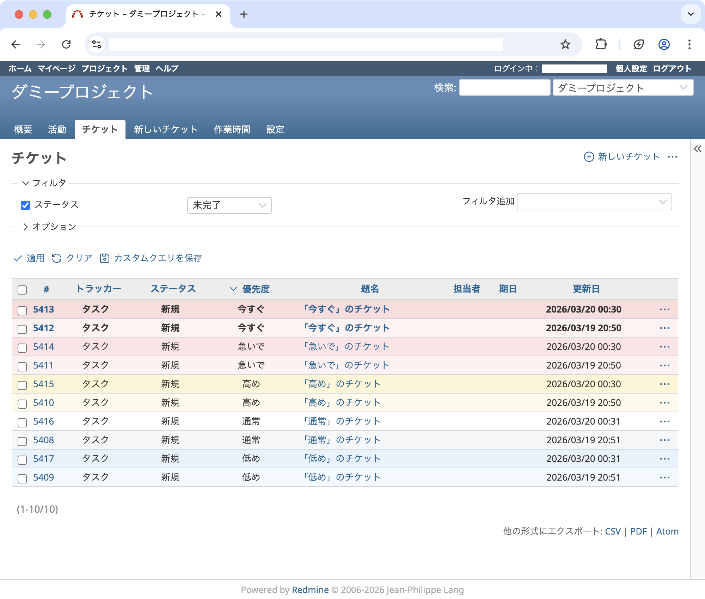

# Priority Colors — Redmine Theme

チケット一覧の行を優先度に応じて背景色で色分け表示する Redmine テーマ。

## スクリーンショット



## 対応バージョン

- Redmine 6.1+

## インストール

```bash
cd /path/to/redmine/app/assets/themes
git clone https://github.com/teruhirokomaki/redmine-theme-priority-colors priority_colors
```

Redmine を再起動し、管理 → 設定 → 表示 → テーマ で **Priority colors** を選択。

> テーマの表示名は Redmine がディレクトリ名から自動生成します。アンダースコア区切りのディレクトリ名を使用してください。

## 優先度と色の対応

| 優先度 | クラス | 背景色 (odd/even) | hover | font-weight |
|---|---|---|---|---|
| 低め (Lowest) | `priority-lowest` | `#e8f1fc` / `#f3f8ff` | `#dce8f8` | — |
| 通常 (Default) | `priority-default` | デフォルト | デフォルト | — |
| 高め (High 3) | `priority-high3` | `#fef6d6` / `#fffbeb` | `#fdf0be` | — |
| 急いで (High 2) | `priority-high2` | `#ffe4e6` / `#fff1f2` | `#fdd8db` | — |
| 今すぐ (Highest) | `priority-highest` | `#fddcdc` / `#fef2f2` | `#fccece` | bold |

> 寒色（青）→ 暖色（赤）のグラデーションで優先度を表現しています。

## コードブロックのコピーボタン

Redmine 標準のコピーボタンは、コードブロックへの `:hover` 時だけ表示されます。ホバーがない、またはポインタが coarse な端末では常時表示するよう、テーマ CSS で上書きしています。あわせて `z-index` を指定し、`pre` の背面に回らないようにしています。

## ライセンス

MIT
